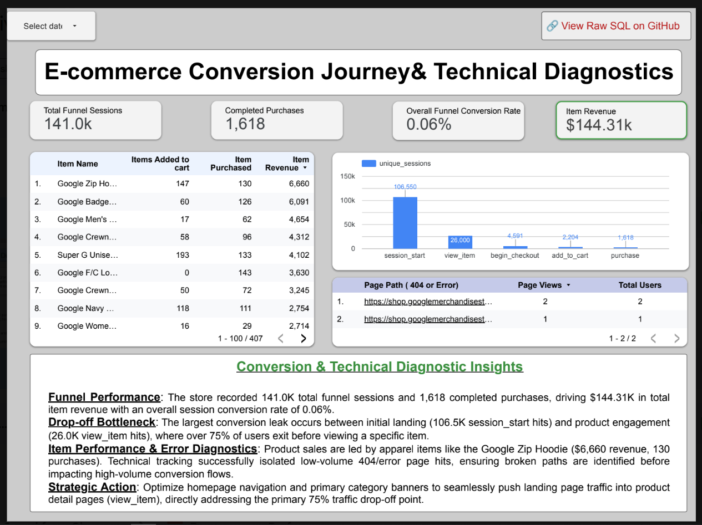

# 📊GA4 E-commerce Analytics: Revenue, Funnel & Growth Diagnostics

## 📌 Executive Summary
This project analyzes **Google Analytics 4 (GA4)** e-commerce data hosted in **Google BigQuery** to diagnose revenue bottlenecks, quantify marketing campaign efficiency, and pinpoint critical website user drop-offs. 

The underlying data transformations were engineered using modular **SQL views**, which feed directly into an interactive 5-page **Looker Studio Dashboard** built for business stakeholders and executive decision-makers.

* **🔗 Live Interactive Dashboard:** [View Looker Studio Dashboard](https://datastudio.google.com/reporting/6d0c2820-01da-4a19-ace0-a1e9f5512985)
* **📄 Full Case Study:** [View PDF Report](./docs/GA4-Ecommerce-Analytics-Case-Study.pdf)
* **💻 Raw SQL Transformations:** Located in the [`/sql`](./sql) folder.

---
## 🎯 Business Questions

This analysis was designed to answer the following business questions:

1. Which marketing channels and campaigns generate the strongest revenue and purchase performance?
2. Which traffic sources show poor session quality and require further investigation?
3. Where is the largest drop-off in the customer journey?
4. Which products contribute most to e-commerce revenue?
5. Are there technical issues, such as 404/error pages, that may affect the user experience?

---

## 🛠️ Data Architecture & Tech Stack

* **Data Source:** GA4 Public E-commerce Dataset (`bigquery-public-data.ga4_obfuscated_sample_ecommerce`)
* **Data Warehouse:** Google BigQuery
* **Querying & Modeling:** Standard SQL (Nested Record Unnesting, CTEs, Window Functions)
* **Business Intelligence:** Looker Studio

Data Flow: GA4 Raw Event Stream → Google BigQuery Transformations (v_business_performance, v_ux_and_page_analytics, v_funnel_analytics) → Looker Studio Executive Dashboard

---

## 💡 Key Business Findings & Recommendations

1. **Paid Traffic Quality Requires Investigation**
   * **Finding:** Non-organic paid traffic recorded the highest observed bounce rate (~49.8%), indicating lower session quality compared with other major traffic sources.
   * **Business Interpretation:** This pattern may indicate a mismatch between audience targeting, campaign messaging, landing-page relevance, or visitor intent.
   * **Recommended Action:** Investigate paid campaign targeting and landing-page alignment before increasing investment. Compare campaign-level performance to identify underperforming traffic sources.

2. **Largest Observed Drop-Off Occurs Before Product Engagement**
   * **Finding:** More than 75% of observed funnel activity drops between `session_start` and `view_item`, making this the largest drop-off point in the analyzed journey.
   * **Business Interpretation:** Users may not be progressing from their entry experience to product discovery. Landing-page relevance, navigation, page content, and traffic intent are potential areas for further investigation.
   * **Recommended Action:** Prioritize analysis and testing of high-traffic landing pages and product discovery paths to identify opportunities to improve progression to `view_item`.

3. **Technical Error Paths Were Identified**
   * **Finding:** The analysis identified a small number of 404/error page paths requiring monitoring.
   * **Business Interpretation:** While the observed error volume is low, broken or invalid URLs can negatively affect user experience when they occur.
   * **Recommended Action:** Monitor error-page paths and investigate recurring sources. Implement redirects or correct invalid campaign/website URLs where a recurring issue is confirmed.

---

## 📂 Repository Structure & SQL Files

The [`/sql`](./sql) directory contains all data pipelines and analysis scripts:

* [`sql/01_v_business_performance.sql`](./sql/01_v_business_performance.sql): Aggregates revenue, session volume, purchase counts, and campaign ROI.
* [`sql/02_v_ux_and_page_analytics.sql`](./sql/02_v_ux_and_page_analytics.sql): Models landing page entrances, total pageviews, unique users, and 404 page health.
* [`sql/03_v_funnel_analytics.sql`](./sql/03_v_funnel_analytics.sql): Builds the e-commerce purchase funnel (session_start → view_item → add_to_cart  → begin_checkout → purchase) and product performance.
* [`sql/04_ad_hoc_business_queries.sql`](./sql/04_ad_hoc_business_queries.sql): Contains 8 dedicated analytical queries used for deep-dive exploratory data analysis.

---

## 🚀 How to Replicate

1. Connect your Google Cloud Console to the public GA4 dataset.
2. Execute the view queries located in the `/sql` directory in sequential order within BigQuery.
3. Connect Looker Studio to the three newly generated views (`v_business_performance`, `v_ux_and_page_analytics`, `v_funnel_analytics`).
